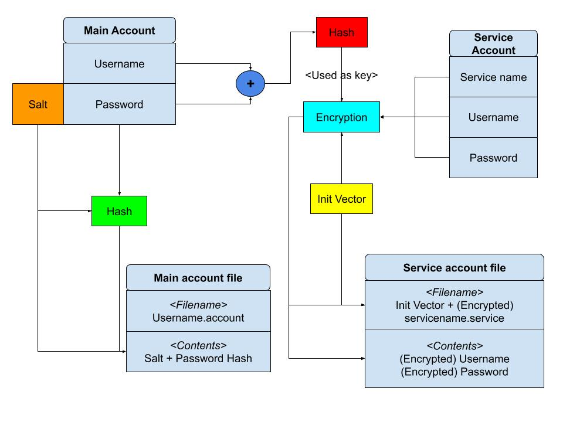

#Passager

## Design
When I first started working on this project, I did quite a bit of planning and designing before I actually implemented
anything. I tried to map out the architecture as well as I could before a single row of code was written. Configurability
was one of my main design goals so that I'd be able to change implementations for parts of the system more easily. I went
for the modular design so that for example data storage could be changed later on just by implementing the API the module
offers. *Main* aims to be the module that handles startup, *data_formats* contains the data structures shared by the
modules, *storage* handles loading and storing the data on and from disk, *interface* offers the user interface and *core*
handles the system's logic after successful login by utilizing all of the other modules (except main, of course).

This is the first project where I went with a well considered top-down design rather than bottom-up. I tried to build as
exhaustive understanding of the system as I could before writing a single line of code. This was indeed an interesting
way of doing things and certainly did aid me in avoiding the most apparent pitfalls. Even with a major design flaw in the
logic of data storage, I was able to reimplement the affected parts without a major revamp of the system thanks to the
modular design.

##Password storage

### Generally
The usual way of storing passwords includes [salting] and [hashing] them as it's not necessary to store the actual
plaintext. A salt is generated for every new password, appended into the actual password, hashed and the salt is
appended to the password hash. To check whether a plaintext password is the correct one, append the salt from the salted
password hash to the plaintext, hash it and compare it to the stored password hash. This means that the actual password
is never stored in a way that it could be reversed into plaintext.

### In Passager
As passager is a password manager, the stored passwords cannot be stored as hashes. It's a major feature of the software
to reverse the passwords for the user to see them. The way to achieve this, in a secure manner, is to use encryption.
Unlike cryptographic hashes, encryptions can be reversed. Depending on the algorithm, this requires that the encryption
key is known, the possible [initialization vector] and the possible [message authentication code].

Passager offers different handling for **main accounts** and **service accounts**. Main accounts are the Passager
accounts for which service accounts are added. The service accounts can be named as the user sees fit as long as the
service names are unique. As main account's password is up for the user to remember, it can be stored as salted hash.
However, the service accounts' credentials need to be reversible and thus encryption is used.

There are a plenty of options for both encryption and hashing. It's recommended to use solutions made by actual experts
rather than implementing own as they're theoretically proven to be secure (at least for the time being). As Python
standard library offers hashing algorithms via the [hashlib] library, I decided to go for that. As dependencies create
possibilities for security vulnerabilities, it's best to avoid them if possible. The standard library's implementations
offer what is needed and there's no need to install additional libraries. As for the hash used, I chose **SHA256** as that
seems to be considered secure[[1]][[2]][[3]]. **PBKDF2_HMAC** offers the resource cost needed to make hash cracking more
tedious and less efficient. I chose 150,000 iterations for the HMAC as that seemed to be a nice number based on the
testing I did. Sure, my laptop may not be the hash cracking beast that the potential attackers would use, but the login
times should also be considered from the actual user's point of view as well.

As for the encryption, I went with [PyCrypto]. I found a few (yet possibly a little bit outdated) articles and discussions
endorsing PyCrypto and decided to try it out. Even if not really kept up-to-date anymore, PyCrypto does offer a fairly
secure encryption with an easy-to-use API.

Here's a hastily drawn illustration of the data storage (with no special notation used).

The salt & init vectors are generated every time there's changes in the stored data in an attempt to make hash / encryption
cracking more tedious. The encryption key for the service account's credentials is derived from the main account's
username and password by hashing them. This is so that the encryption key is **unique** (due to username) for the main
account and **secret** (due to password). This means that every time main account's password is changed, all of said
account's service account files must also be refreshed with the new password.

[salting]: https://en.wikipedia.org/wiki/Salt_(cryptography)
[hashing]: https://en.wikipedia.org/wiki/Cryptographic_hash_function
[initialization vector]: https://en.wikipedia.org/wiki/Initialization_vector
[message authentication code]: https://en.wikipedia.org/wiki/Message_authentication_code
[hashlib]: https://docs.python.org/3/library/hashlib.html

[PyCrypto]: https://www.dlitz.net/software/pycrypto/